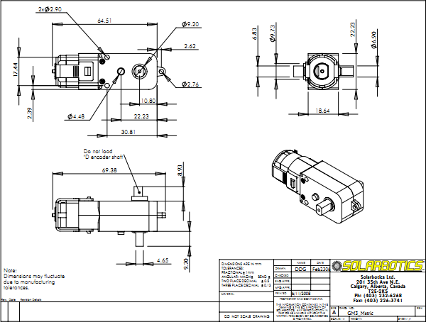
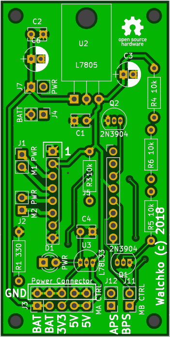
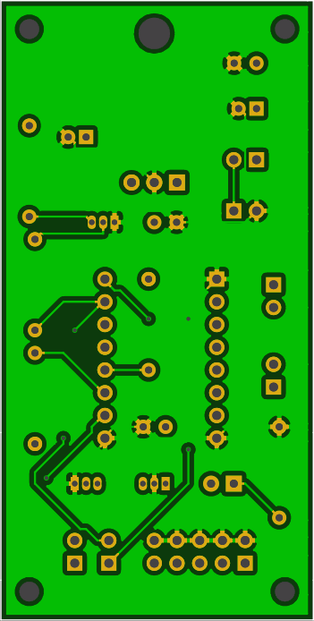

# DFEC Robot

## Hardware

Frame developed using [OpenScad](http://www.openscad.org/)

[Base plate](base.stl)

[Motor mounts](motor.stl)

## Motors

## PCB

PCB version 4 is the current version.

